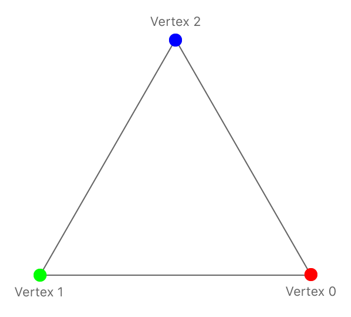

# Learn Apple Metal

从这里开始，Apple的[Metal官方主页](https://developer.apple.com/cn/metal/):

页面上包含了很多文档和工具的重要链接：

    Metal (英文):
    Metal 着色语言规范 (英文)
    使用 Metal 功能集表 (英文)
    MetalKit (英文)
    Metal 性能着色器 (英文)
    使用 GPU 计数器工具优化性能 (英文)
    启用帧捕获 (英文)
    减少 Metal App 的内存占用空间 (英文)


## [Metal文档主页](https://developer.apple.com/documentation/metal/)

- Metal works hand-in-hand with other frameworks that supplement its capability.

    Use `MetalKit` to simplify the task of getting your Metal content onscreen.
    Use `Metal Performance Shaders` to implement custom rendering functions or to take advantage of a large library of existing functions.

- Many high level Apple frameworks are built on top of Metal to take advantage of its performance, including `Core Image`, `SpriteKit`, and `SceneKit`.

</br>
</br>

## [PART 1 : Basic Tasks and Concepts](https://developer.apple.com/documentation/metal/basic_tasks_and_concepts)

### [Chapter 1. Performing Calculations on a GPU](https://developer.apple.com/documentation/metal/basic_tasks_and_concepts/performing_calculations_on_a_gpu)
----

#### 0. Overview

在此示例中，您将学习在所有 Metal 应用程序中使用的基本任务。您将学习如何将用C编写的简单函数转换为 Metal 着色器色语言 (MSL)，以便它可以在 GPU 上运行。您首先需要获取一个GPU，并创建 Pipeline 为 MSL 函数在 GPU 上运行准备好环境，并创建GPU可访问的数据对象。要让 Pileline 处理您的数据，需要创建一个命令缓冲区，将命令写入其中，并将缓冲区提交到命令队列。 Metal 将命令发送到 GPU 以执行。

#### 1. Write a GPU Function to Perform Calculations

为了演示 GPU 编程，这个应用程序将两个数组的对应元素相加，将结果写入第三个数组。代码1 展示了一个用 C 语言编写的在 CPU 上执行此计算的函数。它遍历索引，每次循环迭代计算一个值。

**Listing 1** Array addition, written in C

```c
void add_arrays(const float* inA,
                const float* inB,
                float* result,
                int length)
{
    for (int index = 0; index < length ; index++)
    {
        result[index] = inA[index] + inB[index];
    }
}
```

每个值都是独立计算的，因此可以安全地并行计算这些值。要在 GPU 上执行计算，您需要用 Metal Shading Language (MSL) 重写此函数。MSL 是为 GPU 编程设计的 C++ 变体。在 Metal 中，在 GPU 上运行的代码称为**着色器（Shader）**，因为历史上它们首先是用于计算 3D 图形中的颜色。代码2 显示了 MSL 中的一个着色器，它执行与 代码1 相同的计算。示例项目在文件`add.metal.metal`中定义了这个函数。Xcode 将应用程序目标中的所有`.metal`文件编译为一个默认的 Metal 库文件，并将其嵌入到您的应用程序中。您将在本示例后面看到如何加载默认库。

**Listing 2** Array addition, written in MSL

```c
kernel void add_arrays(device const float* inA,
                       device const float* inB,
                       device float* result,
                       uint index [[thread_position_in_grid]])
{
    // the for-loop is replaced with a collection of threads, each of which
    // calls this function.
    result[index] = inA[index] + inB[index];
}
```

代码1 和 代码2 非常相似，但在 MSL 版本中有一些重要的区别。请仔细查看 代码2。
首先，函数添加了kernel关键字，它声明函数为：
- A public GPU function: `Public functions`是您的应用程序可以看到的唯一函数类型。`Public functions`也不能被其他着色器函数调用。
- A compute function (also known as a compute kernel): 它使用线程网格执行并行计算(parallel calculation using a grid of threads)。

请参阅 [Using a Render Pipeline to Render Primitives](https://developer.apple.com/documentation/metal/using_a_render_pipeline_to_render_primitives) 了解用于声明公共图形函数的其他函数关键字。

`add_arrays`函数用`device`关键字声明了它的三个参数，表示这些指针位于`device`地址空间中。MSL 为内存定义了几个不相交的地址空间。每当你在 MSL 中声明一个指针时，你必须提供一个关键字来声明它的地址空间。使用`device`地址空间来声明 GPU 可以读取和写入的持久内存。

代码2 从代码1 中删除了 for 循环，因为该函数现在将被`compute grid`中的多个线程调用。此示例创建与数组尺寸完全匹配的一维线程网格，因此数组中的每个条目都由不同的线程计算。

为了替换以前由 for 循环提供的索引，该函数采用一个新index参数，以及另一个使用 C++ 属性语法指定的 MSL 关键字 thread_position_in_grid。这个关键字声明 Metal 应该为每个线程计算一个唯一的索引，并在参数中传递给对应的index。因为add_arrays使用一维网格，所以索引被定义为一个标量整数。即使删除了循环，代码1 和代码2 也使用相同的代码将两个数字相加。如果您想将类似的代码从 C 或 C++ 转换为 MSL，请以相同的方式将循环逻辑替换为网格计算。

#### 2. Find a GPU

在您的应用程序中，[MTLDevice](https://developer.apple.com/documentation/metal/mtldevice) 对象是 GPU 的一个`轻(thin)`抽象，您使用它与 GPU 进行通信。Metal 为每个 GPU 创建了一个MTLDevice 对象。您可以通过调用 [MTLCreateSystemDefaultDevice()](https://developer.apple.com/documentation/metal/1433401-mtlcreatesystemdefaultdevice)获取默认设备对象 。在 macOS 中，Mac 可以有多个 GPU，Metal 选择其中一个 GPU 作为默认值并返回该 GPU 的设备对象。在 macOS 中，Metal 提供了其他可用于检索所有设备对象的 API，但此示例仅使用默认GPU对象。

```Swift
id<MTLDevice> device = MTLCreateSystemDefaultDevice();
```

#### 3. Initialize Metal Objects

Metal 将其他与 GPU 相关的实体（如着色器、内存缓冲区和纹理）表示为对象。要创建这些特定的 GPU 对象，您可以直接调用 `MTLDevice` 的 `methods`，或者调用由 `MTLDevice` 创建的对象上的 `methods`，由设备对象直接或间接创建的所有对象仅可用于这个设备对象。使用多个 GPU 的应用程序将使用多个设备对象，并为每个对象创建类似的 Metal 对象层次结构。

示例应用程序使用自定义类 `MetalAdder` 来管理与 GPU 通信所需的对象。类的初始化程序创建这些对象并将它们存储在其属性中。该应用程序创建此类的一个实例，将其传入用于创建辅助对象的 Metal 设备对象。该`MetalAdder`对象保持对 Metal 对象的强引用，直到它完成执行。

```c
MetalAdder* adder = [[MetalAdder alloc] initWithDevice:device];
```

在 Metal 中，高代价的初始化任务可以运行一次，并将结果保留下来以便后续以较低的代价使用。您很少需要在性能敏感的代码中运行此类任务。


#### 4. Get a Reference to the Metal Function

初始化器做的第一件事是加载函数并准备在 GPU 上运行。当您构建应用程序时，Xcode 会编译 `add_arrays` 函数并将其添加到应用程序的默认 Metal 库中。您可以使用 `MTLLibrary` 和 `MTLFunction` 对象来获取 Metal 库和其中包含的函数。例如要获取表示该 `add_arrays` 函数对象，需要使用MTLDevice来创建 一个 `MTLLibrary` 对象作为默认Metal库，然后使用`MTLLibrary`库提供一个表示着色器函数的 `MTLFunction` 对象。

```Swift
- (instancetype) initWithDevice: (id<MTLDevice>) device
{
    self = [super init];
    if (self)
    {
        _mDevice = device;

        NSError* error = nil;

        // Load the shader files with a .metal file extension in the project

        id<MTLLibrary> defaultLibrary = [_mDevice newDefaultLibrary];
        if (defaultLibrary == nil)
        {
            NSLog(@"Failed to find the default library.");
            return nil;
        }

        id<MTLFunction> addFunction = [defaultLibrary newFunctionWithName:@"add_arrays"];
        if (addFunction == nil)
        {
            NSLog(@"Failed to find the adder function.");
            return nil;
        }
```

#### 5. Prepare a Metal Pipeline

函数对象是 MSL 函数的代理，但它不是可执行代码。您可以通过创建 `Pipeline` 将函数转换为可执行代码。`Pipeline`指定 GPU 为完成特定任务而执行的步骤。在 Metal 中 `Pipeline` 由 `pipeline state object`表示。由于此示例使用`compute function`，因此应用程序会创建一个 [MTLComputePipelineState](https://developer.apple.com/documentation/metal/mtlcomputepipelinestate) 对象。

```Swift
_mAddFunctionPSO = [_mDevice newComputePipelineStateWithFunction: addFunction error:&error];
```

`compute pipeline` 运行单个计算函数，可选择在运行函数之前处理输入数据，然后处理输出数据。

当您创建 `pipeline state object` 时，设备对象会完成针对此特定 GPU 的函数编译。此示例同步创建管道状态对象并将其直接返回给应用程序。因为编译确实需要一段时间，所以避免在性能敏感代码中同步创建管道状态对象。

```
    Note

    All of the objects returned by Metal in the code you’ve seen so far are returned as objects that conform to protocols. Metal defines most GPU-specific objects using protocols to abstract away the underlying implementation classes, which may vary for different GPUs. Metal defines GPU-independent objects using classes. The reference documentation for any given Metal protocol make it clear whether you can implement that protocol in your app.
```

#### 6. Create a Command Queue

要将工作发送到 GPU，您需要一个命令队列。Metal 使用命令队列来调度命令。通过向`MTLDevice`发送请求来创建一个命令队列。

```Swift
_mCommandQueue = [_mDevice newCommandQueue];

```

#### 7. Create Data Buffers and Load Data
初始化基本 Metal 对象后，需要加载数据供 GPU 执行。此任务对性能的要求不高，但在应用程序启动的早期执行仍然很有用。

GPU 可以拥有自己的专用内存，也可以与操作系统共享内存。Metal 和操作系统内核需要执行额外的工作才能让您将数据存储在内存中并使这些数据可供 GPU 使用。Metal 使用 `resource objects` 抽象了这种内存管理。[(MTLResource)](https://developer.apple.com/documentation/metal/mtlresource)资源是 GPU 在运行命令时可以访问的被分配的内存。使用 `MTLDevice` 对象为 GPU 创建内存资源。

```Swift
_mBufferA = [_mDevice newBufferWithLength:bufferSize options:MTLResourceStorageModeShared];
_mBufferB = [_mDevice newBufferWithLength:bufferSize options:MTLResourceStorageModeShared];
_mBufferResult = [_mDevice newBufferWithLength:bufferSize options:MTLResourceStorageModeShared];

[self generateRandomFloatData:_mBufferA];
[self generateRandomFloatData:_mBufferB];
```

此示例中的资源是 [( MTLBuffer)](https://developer.apple.com/documentation/metal/mtlbuffer) 对象，它们是没有预定义格式的内存分配。Metal 将每个缓冲区作为不透明的字节集合进行管理，在着色器中使用缓冲区时需要指定格式。这意味着您的着色器和应用程序需要就来回传递的任何数据的格式达成一致。

当你分配一个缓冲区时，你提供了一种存储模式来确定它的一些性能特征以及 CPU 或 GPU 是否可以访问它。示例应用程序使用CPU 和 GPU 都可以访问的共享内存 [(storageModeShared)](https://developer.apple.com/documentation/metal/mtlresourceoptions/1515613-storagemodeshared).

为了用随机数据填充缓冲区，应用程序获取指向缓​​冲区内存的指针并在CPU上将数据写入。代码2 中的add_arrays函数将其参数声明为浮点数数组，因此您可以提供相同格式的缓冲区：

```Swift
- (void) generateRandomFloatData: (id<MTLBuffer>) buffer
{
    float* dataPtr = buffer.contents;

    for (unsigned long index = 0; index < arrayLength; index++)
    {
        dataPtr[index] = (float)rand()/(float)(RAND_MAX);
    }
}
```

#### 8. Create a Command Buffer

请求命令队列创建命令缓冲区。

```Swift
id<MTLCommandBuffer> commandBuffer = [_mCommandQueue commandBuffer];
```

#### 9. Create a Command Encoder
要将命令写入命令​​缓冲区，您可以使用命令编码器(`command encoder`)来处理您要编码的特定类型的命令。此示例创建一个计算命令编码器，该编码器对计算过程进行编码。计算通道(`compute pass`)包含执行计算管道(`compute pipelines`)的命令列表。每个计算命令都会使 GPU 创建一个线程网格(`grid of threads`)以在 GPU 上执行。

```swift
id<MTLComputeCommandEncoder> computeEncoder = [commandBuffer computeCommandEncoder];
```


#### 10. Set Pipeline State and Argument Data

设置您希望命令执行的`管道(pipeline)`的`管道状态对象(pipeline state object`)，然后为管道设置需要发送到add_arrays函数的参数数据。对于本示例管道，这些参数数据意味着提供对三个缓冲区的引用。Metal 按照参数出现在 代码2 中的函数声明中的顺序自动为从0开始为缓冲区参数分配索引. 您使用相同的索引提供参数。

```Swift
[computeEncoder setComputePipelineState:_mAddFunctionPSO];
[computeEncoder setBuffer:_mBufferA offset:0 atIndex:0];
[computeEncoder setBuffer:_mBufferB offset:0 atIndex:1];
[computeEncoder setBuffer:_mBufferResult offset:0 atIndex:2];
```

您还可以为每个参数指定一个偏移量。偏移量0表示命令将从缓冲区的开头访问数据。但是，您可以使用一个缓冲区来存储多个参数，并为每个参数指定一个偏移量。

您没有为 index 参数指定任何数据，因为add_arrays函数将其值定义为由 GPU 提供。

#### 11. Specify Thread Count and Organization

接下来，决定创建多少线程以及如何组织这些线程。Metal 可以创建 1D、2D 或 3D 网格。add_arrays函数使用一维数组，因此示例创建一个大小为 (dataSize x 1 x 1) 的一维网格，Metal 从中生成介于 0 和 dataSize-1 之间的索引。

```Swift
MTLSize gridSize = MTLSizeMake(arrayLength, 1, 1);
```

#### 12. Specify Threadgroup Size

Metal 将网格细分为更小的网格，称为`线程组(threadgroups)`。每个`线程组(threadgroups)`都是单独计算的，Metal 可以将`线程组(threadgroups)`分派给 GPU 上的不同处理元素以加快处理速度，您还需要决定为您的命令创建多大的线程组。

```Swift
NSUInteger threadGroupSize = _mAddFunctionPSO.maxTotalThreadsPerThreadgroup;
if (threadGroupSize > arrayLength)
{
    threadGroupSize = arrayLength;
}
MTLSize threadgroupSize = MTLSizeMake(threadGroupSize, 1, 1);
```

应用程序向`管道状态对象(pipeline state object)`询问最大可能的线程组，如果该大小大于数据集的大小，则将其缩小。[maxTotalThreadsPerThreadgroup](https://developer.apple.com/documentation/metal/mtlcomputepipelinestate/1414927-maxtotalthreadsperthreadgroup)属性给出了线程组中允许的最大线程数，这取决于用于创建`管道状态对象(pipeline state object)`的函数的复杂性。

#### 13. Encode the Compute Command to Execute the Threads

最后，对命令进行编码以调度线程网格。

```Swift
[computeEncoder dispatchThreads:gridSize
          threadsPerThreadgroup:threadgroupSize];
```

当 GPU 执行这个命令时，它会使用你之前设置的状态和命令的参数来调度线程来执行计算。

您可以使用`编码器(encoder)`按照相同的步骤将多个计算命令编码到计算通道中，而无需执行任何冗余步骤。例如，您可以设置`管道状态对象(pipeline state object)`一次，然后为要处理的每个缓冲区集合设置参数和编码一个命令。

#### 14. End the Compute Pass

当您没有更多命令要添加到`计算通道(compute pass)`时，您将结束编码过程以关闭计算通道。

```Swift
[computeEncoder endEncoding];
```

#### 15. Commit the Command Buffer to Execute Its Commands

通过将命令缓冲区提交到队列来运行命令缓冲区中的命令。

```Swift
[commandBuffer commit];
```

因为命令队列创建了命令缓冲区，因此提交缓冲区总是将其放在该队列中。提交命令缓冲区后，Metal 会异步准备要执行的命令，然后安排命令缓冲区在 GPU 上执行。在 GPU 执行完命令缓冲区中的所有命令后，Metal 将命令缓冲区标记为完成。

#### 16. Wait for the Calculation to Complete

当 GPU 处理您的命令时，您的应用程序可以执行其他工作。这个示例不需要做任何额外的工作，所以它只是等到命令缓冲区完成。

```Swift
[commandBuffer waitUntilCompleted];
```

或者，要在 Metal 处理完所有命令时收到通知，请向命令缓冲区 [(addCompletedHandler(_:)status)](https://developer.apple.com/documentation/metal/mtlcommandbuffer/1442997-addcompletedhandler) 添加完成处理程序，或通过读取命令缓冲区的属性来检查命令缓冲区的状态。

#### 17. Read the Results From the Buffer
命令缓冲区完成后，GPU 的计算存储在输出缓冲区中，并且 Metal 执行必要的步骤以确保 CPU 可以看到它们。在真正的应用程序中，您会从缓冲区读取结果并对其进行处理，例如在屏幕上显示结果或将它们写入文件。由于计算仅用于说明创建 Metal 应用程序的过程，因此示例读取存储在输出缓冲区中的值并进行测试以确保 CPU 和 GPU 计算出相同的结果。

```Swift
- (void) verifyResults
{
    float* a = _mBufferA.contents;
    float* b = _mBufferB.contents;
    float* result = _mBufferResult.contents;

    for (unsigned long index = 0; index < arrayLength; index++)
    {
        if (result[index] != (a[index] + b[index]))
        {
            printf("Compute ERROR: index=%lu result=%g vs %g=a+b\n",
                   index, result[index], a[index] + b[index]);
            assert(result[index] == (a[index] + b[index]));
        }
    }
    printf("Compute results as expected\n");
}

```


</br>
</br>

### [Chapter 2. Using Metal to Draw a View’s Contents](https://developer.apple.com/documentation/metal/basic_tasks_and_concepts/using_metal_to_draw_a_view_s_contents)
----
创建一个 MetalKit 视图和一个`渲染通道(render pass)`来绘制视图的内容。

#### Overview
在此示例中，您将学习使用 Metal 渲染图形内容的基础知识。您将使用 `MetalKit framework` 创建一个使用 Metal 绘制可视内容的`视图(view)`，然后，您将为`渲染通道(render pass)`编码命令将视图清除为背景颜色。

    Note

    MetalKit automates windowing system tasks, loads textures, and handles 3D model data. See MetalKit for more information.

#### Prepare a MetalKit View to Draw

MetalKit 提供了一个名为 [MTKView](https://developer.apple.com/documentation/metalkit/mtkview) 的类，它是 [NSView](https://developer.apple.com/documentation/appkit/nsview)（在 macOS 中）或 [UIView](https://developer.apple.com/documentation/uikit/uiview)（在 iOS 和 tvOS 中）的子类，`MTKView` 会处理许多在使用 Metal 绘制内容到屏幕上的相关细节。

`MTKView` 需要对 `Metal 设备对象` 的引用才能在其内部创建资源，因此第一步是将视图的 `device` 属性设置为现有的 `MTLDevice`.

```Swift
_view.device = MTLCreateSystemDefaultDevice();
```

其他MTKView属性允许您控制其行为，要将视图的内容擦除为纯色背景，请设置其 [clearColor](https://developer.apple.com/documentation/metalkit/mtkview/1536036-clearcolor) 属性。您可以使用 [MTLClearColorMake(_:_:_:_:)](https://developer.apple.com/documentation/metal/1437971-mtlclearcolormake) 函数创建颜色，指定 R、G、B 和 alpha 值。

```Swift
_view.clearColor = MTLClearColorMake(0.0, 0.5, 1.0, 1.0);
```

因为您不会在此示例中绘制动画内容，所以配置视图使其仅在需要更新内容时绘制，例如当视图改变形状时：

```Swift
_view.enableSetNeedsDisplay = YES;
```

#### Delegate Drawing Responsibilities

MTKView 依靠您的应用程序向 Metal 发出命令以生成视觉内容，MTKView使用委托模式通知您的应用程序何时应该绘制，要接收委托回调，需要将视图的 `delegate` 属性设置为符合 [MTKViewDelegate](https://developer.apple.com/documentation/metalkit/mtkviewdelegate) 协议的对象。

```Swift
_view.delegate = _renderer;
```

委托实现了两种方法：
- 只要内容的大小发生变化，视图就会调用 [mtkView(_:drawableSizeWillChange:)](https://developer.apple.com/documentation/metalkit/mtkviewdelegate/1536015-mtkview) 方法。当包含视图的窗口调整大小或设备方向更改（在 iOS 上）时，会发生这种情况。这允许您的应用程序调整其呈现的分辨率以适应视图的大小。

- 每当需要更新视图的内容时，视图就会调用 [draw(in:)](https://developer.apple.com/documentation/metalkit/mtkviewdelegate/1535942-draw) 方法。在这种方法中，您需要创建一个`命令缓冲区(command buffer)`，对 GPU 绘制什么以及何时在屏幕上显示的`命令(commands)`进行编码，并将该命令缓冲区排入队列让 GPU 执行。这有时被称为帧绘制，可以将帧视为生成单个图像并显示在屏幕上的所有工作，在游戏这样的交互式应用程序中，每秒可能会绘制许多帧。

在这个示例中，一个名为 `AAPLRenderer` 的类实现了委托方法并承担了绘图的工作，`视图控制器(view controller)`创建此类的一个实例并将其设置为视图的委托。


#### Create a Render Pass Descriptor

当绘制时，GPU 将结果存储到`纹理(textures)`中，纹理是包含图像数据且可供 GPU 访问的`内存块`。在此示例中，MTKView 创建了您需要绘制到视图中的所有纹理。它创建多个纹理，以便在渲染到另一个纹理时显示一个纹理的内容。

要进行绘制，您需要创建一个 `渲染通道(render pass)` ，它是用来绘制一个纹理集合的渲染命令序列。在`渲染通道(render pass)` 中，`纹理(textures)`也称为`渲染目标(render targets)`。要创建`渲染通道(render pass)` ，您需要一个`渲染通道描述符(render pass descriptor)`，MTLRenderPassDescriptor的一个实例。 在本示例中，不是配置您自己的渲染通道描述符，而是使用 MetalKit 视图创建一个。

```Swift
MTLRenderPassDescriptor *renderPassDescriptor = view.currentRenderPassDescriptor;
if (renderPassDescriptor == nil)
{
    return;
}
```

`渲染通道描述符(render pass descriptor)`描述了一组`渲染目标(render targets),`，以及在`渲染通道(render pass)`的开始和结束时应该如何处理它们，`渲染通道(render pass)`还定义了此示例未涉及的渲染的其他些方面。上述视图返回一个带有单个颜色`附件(attachment)`的渲染通道描述符，该附件指向视图的纹理之一，否则根据视图的属性配置渲染通道。默认情况下，这意味着在渲染过程开始时，渲染目标被擦除为与视图`clearColor`属性匹配的纯色，并且在渲染过程结束时，所有更改都将存储回纹理。

因为视图的渲染通道描述符可能是nil，您应该在创建渲染通道之前进行测试以确保渲染通道描述符对象是非nil的。

#### Create a Render Pass

您可以使用 [MTLRenderCommandEncoder](https://developer.apple.com/documentation/metal/mtlrendercommandencoder) 对象将其编码到命令缓冲区来创建 `渲染通道(render pass)` 。调用命令缓冲区的 [makeRenderCommandEncoder(descriptor:)](https://developer.apple.com/documentation/metal/mtlcommandbuffer/1442999-makerendercommandencoder)方法并传入`渲染通道描述符(render pass descriptor)`。

```Swift
id<MTLRenderCommandEncoder> commandEncoder = [commandBuffer renderCommandEncoderWithDescriptor:renderPassDescriptor];
```

在此示例中，没有对任何绘图命令进行编码，因此渲染过程所做的唯一事情就是擦除纹理。调用编码器的`endEncoding`方法表示pass已经完成。

```Swift
[commandEncoder endEncoding];
```

#### Present a Drawable to the Screen
绘制到纹理并不会自动在屏幕上显示新内容，实际上，屏幕上只能呈现某些纹理。在 Metal 中，可以在屏幕上显示的纹理由可`绘制对象(drawable objects)`管理，并且要显示内容，您需要呈现可绘制对象。

MTKView自动创建可绘制对象来管理其纹理，读取`currentDrawable` 属性以获取拥有作为`渲染通道目标(render pass’s target)`的纹理的可绘制对象。视图返回一个`CAMetalDrawable`对象，一个连接到 `Core Animation` 的对象。

```Swift
id<MTLDrawable> drawable = view.currentDrawable;
```
调用命令缓冲区上的[present(_:)](https://developer.apple.com/documentation/metal/mtlcommandbuffer/1443029-present)方法，传入drawable对象。

```Swift
[commandBuffer presentDrawable:drawable];
```
这个方法告诉 Metal，当命令缓冲区被调度执行时，Metal 应该与 `Core Animation` 协调在渲染完成后显示纹理。当 `Core Animation` 呈现纹理时，它成为视图的新内容。在此示例中，这意味着已擦除的纹理将成为视图的新背景。该更改与 `Core Animation` 为屏幕用户界面元素所做的任何其他视觉更新一起发生。

#### Commit the Command Buffer
现在您已经为帧绘制准备好了所有命令，把它提交命令缓冲区。

```Swift
[commandBuffer commit];
```

</br>
</br>

### [Chapter 3. Using a Render Pipeline to Render Primitives](https://developer.apple.com/documentation/metal/using_a_render_pipeline_to_render_primitives)

渲染一个简单的2D三角形。

#### Overview

在上一节内容中学习了如何设置MTKView对象并使用渲染通道更改视图的内容，但上一示例只是将视图的内容擦除为背景颜色。本示例向您展示如何配置`渲染管道(render pipeline)`并将其用作`渲染通道(render pass)`的一部分，以在视图中绘制一个简单的 2D 彩色三角形。该示例为每个`顶点(vertex)`提供位置和颜色，`渲染管道(render pipeline)`使用该数据渲染三角形，在为三角形顶点指定的颜色之间插入颜色值。



Xcode 项目包含可以在 macOS、iOS 和 tvOS 上运行示例的代码。

