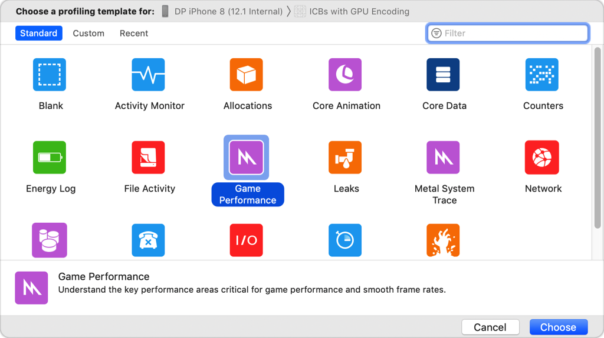
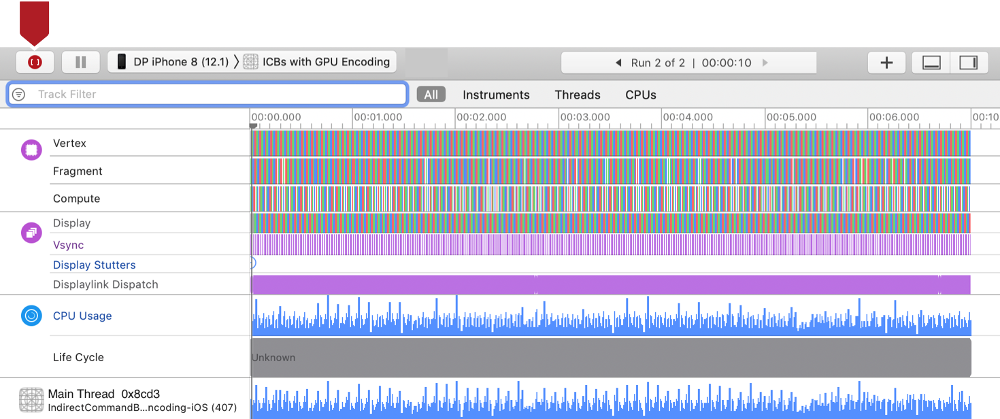
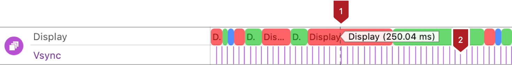
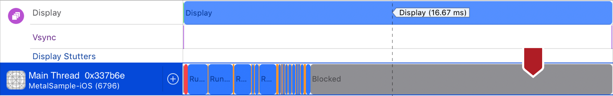
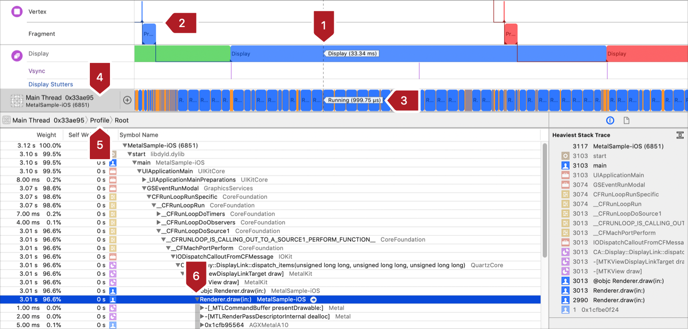
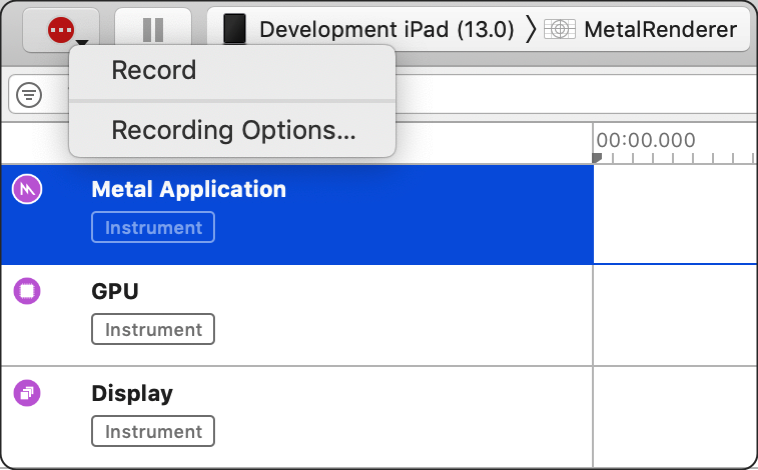

# Learn Apple Metal

从这里开始，Apple的[Metal官方主页](https://developer.apple.com/cn/metal/):

页面上包含了很多文档和工具的重要链接：

    Metal (英文):
    Metal 着色语言规范 (英文)
    使用 Metal 功能集表 (英文)
    MetalKit (英文)
    Metal 性能着色器 (英文)
    使用 GPU 计数器工具优化性能 (英文)
    启用帧捕获 (英文)
    减少 Metal App 的内存占用空间 (英文)


## [Metal文档主页](https://developer.apple.com/documentation/metal/)

- Metal works hand-in-hand with other frameworks that supplement its capability.

    Use `MetalKit` to simplify the task of getting your Metal content onscreen.
    Use `Metal Performance Shaders` to implement custom rendering functions or to take advantage of a large library of existing functions.

- Many high level Apple frameworks are built on top of Metal to take advantage of its performance, including `Core Image`, `SpriteKit`, and `SceneKit`.

</br>
</br>

## [PART 1 : Basic Tasks and Concepts](https://developer.apple.com/documentation/metal/basic_tasks_and_concepts)

### [Chapter 1. Performing Calculations on a GPU](https://developer.apple.com/documentation/metal/basic_tasks_and_concepts/performing_calculations_on_a_gpu)
----

#### 0. Overview

在此示例中，您将学习在所有 Metal 应用程序中使用的基本任务。您将学习如何将用C编写的简单函数转换为 Metal 着色器色语言 (MSL)，以便它可以在 GPU 上运行。您首先需要获取一个GPU，并创建 Pipeline 为 MSL 函数在 GPU 上运行准备好环境，并创建GPU可访问的数据对象。要让 Pileline 处理您的数据，需要创建一个命令缓冲区，将命令写入其中，并将缓冲区提交到命令队列。 Metal 将命令发送到 GPU 以执行。

#### 1. Write a GPU Function to Perform Calculations

为了演示 GPU 编程，这个应用程序将两个数组的对应元素相加，将结果写入第三个数组。代码1 展示了一个用 C 语言编写的在 CPU 上执行此计算的函数。它遍历索引，每次循环迭代计算一个值。

**Listing 1** Array addition, written in C

```c
void add_arrays(const float* inA,
                const float* inB,
                float* result,
                int length)
{
    for (int index = 0; index < length ; index++)
    {
        result[index] = inA[index] + inB[index];
    }
}
```

每个值都是独立计算的，因此可以安全地并行计算这些值。要在 GPU 上执行计算，您需要用 Metal Shading Language (MSL) 重写此函数。MSL 是为 GPU 编程设计的 C++ 变体。在 Metal 中，在 GPU 上运行的代码称为**着色器（Shader）**，因为历史上它们首先是用于计算 3D 图形中的颜色。代码2 显示了 MSL 中的一个着色器，它执行与 代码1 相同的计算。示例项目在文件`add.metal.metal`中定义了这个函数。Xcode 将应用程序目标中的所有`.metal`文件编译为一个默认的 Metal 库文件，并将其嵌入到您的应用程序中。您将在本示例后面看到如何加载默认库。

**Listing 2** Array addition, written in MSL

```c
kernel void add_arrays(device const float* inA,
                       device const float* inB,
                       device float* result,
                       uint index [[thread_position_in_grid]])
{
    // the for-loop is replaced with a collection of threads, each of which
    // calls this function.
    result[index] = inA[index] + inB[index];
}
```

代码1 和 代码2 非常相似，但在 MSL 版本中有一些重要的区别。请仔细查看 代码2。
首先，函数添加了kernel关键字，它声明函数为：
- A public GPU function: `Public functions`是您的应用程序可以看到的唯一函数类型。`Public functions`也不能被其他着色器函数调用。
- A compute function (also known as a compute kernel): 它使用线程网格执行并行计算(parallel calculation using a grid of threads)。

请参阅 [Using a Render Pipeline to Render Primitives](https://developer.apple.com/documentation/metal/using_a_render_pipeline_to_render_primitives) 了解用于声明公共图形函数的其他函数关键字。

`add_arrays`函数用`device`关键字声明了它的三个参数，表示这些指针位于`device`地址空间中。MSL 为内存定义了几个不相交的地址空间。每当你在 MSL 中声明一个指针时，你必须提供一个关键字来声明它的地址空间。使用`device`地址空间来声明 GPU 可以读取和写入的持久内存。

代码2 从代码1 中删除了 for 循环，因为该函数现在将被`compute grid`中的多个线程调用。此示例创建与数组尺寸完全匹配的一维线程网格，因此数组中的每个条目都由不同的线程计算。

为了替换以前由 for 循环提供的索引，该函数采用一个新index参数，以及另一个使用 C++ 属性语法指定的 MSL 关键字 thread_position_in_grid。这个关键字声明 Metal 应该为每个线程计算一个唯一的索引，并在参数中传递给对应的index。因为add_arrays使用一维网格，所以索引被定义为一个标量整数。即使删除了循环，代码1 和代码2 也使用相同的代码将两个数字相加。如果您想将类似的代码从 C 或 C++ 转换为 MSL，请以相同的方式将循环逻辑替换为网格计算。

#### 2. Find a GPU

在您的应用程序中，[MTLDevice](https://developer.apple.com/documentation/metal/mtldevice) 对象是 GPU 的一个`轻(thin)`抽象，您使用它与 GPU 进行通信。Metal 为每个 GPU 创建了一个MTLDevice 对象。您可以通过调用 [MTLCreateSystemDefaultDevice()](https://developer.apple.com/documentation/metal/1433401-mtlcreatesystemdefaultdevice)获取默认设备对象 。在 macOS 中，Mac 可以有多个 GPU，Metal 选择其中一个 GPU 作为默认值并返回该 GPU 的设备对象。在 macOS 中，Metal 提供了其他可用于检索所有设备对象的 API，但此示例仅使用默认GPU对象。

```Swift
id<MTLDevice> device = MTLCreateSystemDefaultDevice();
```

#### 3. Initialize Metal Objects

Metal 将其他与 GPU 相关的实体（如着色器、内存缓冲区和纹理）表示为对象。要创建这些特定的 GPU 对象，您可以直接调用 `MTLDevice` 的 `methods`，或者调用由 `MTLDevice` 创建的对象上的 `methods`，由设备对象直接或间接创建的所有对象仅可用于这个设备对象。使用多个 GPU 的应用程序将使用多个设备对象，并为每个对象创建类似的 Metal 对象层次结构。

示例应用程序使用自定义类 `MetalAdder` 来管理与 GPU 通信所需的对象。类的初始化程序创建这些对象并将它们存储在其属性中。该应用程序创建此类的一个实例，将其传入用于创建辅助对象的 Metal 设备对象。该`MetalAdder`对象保持对 Metal 对象的强引用，直到它完成执行。

```c
MetalAdder* adder = [[MetalAdder alloc] initWithDevice:device];
```

在 Metal 中，高代价的初始化任务可以运行一次，并将结果保留下来以便后续以较低的代价使用。您很少需要在性能敏感的代码中运行此类任务。


#### 4. Get a Reference to the Metal Function

初始化器做的第一件事是加载函数并准备在 GPU 上运行。当您构建应用程序时，Xcode 会编译 `add_arrays` 函数并将其添加到应用程序的默认 Metal 库中。您可以使用 `MTLLibrary` 和 `MTLFunction` 对象来获取 Metal 库和其中包含的函数。例如要获取表示该 `add_arrays` 函数对象，需要使用MTLDevice来创建 一个 `MTLLibrary` 对象作为默认Metal库，然后使用`MTLLibrary`库提供一个表示着色器函数的 `MTLFunction` 对象。

```Swift
- (instancetype) initWithDevice: (id<MTLDevice>) device
{
    self = [super init];
    if (self)
    {
        _mDevice = device;

        NSError* error = nil;

        // Load the shader files with a .metal file extension in the project

        id<MTLLibrary> defaultLibrary = [_mDevice newDefaultLibrary];
        if (defaultLibrary == nil)
        {
            NSLog(@"Failed to find the default library.");
            return nil;
        }

        id<MTLFunction> addFunction = [defaultLibrary newFunctionWithName:@"add_arrays"];
        if (addFunction == nil)
        {
            NSLog(@"Failed to find the adder function.");
            return nil;
        }
```

#### 5. Prepare a Metal Pipeline

函数对象是 MSL 函数的代理，但它不是可执行代码。您可以通过创建 `Pipeline` 将函数转换为可执行代码。`Pipeline`指定 GPU 为完成特定任务而执行的步骤。在 Metal 中 `Pipeline` 由 `pipeline state object`表示。由于此示例使用`compute function`，因此应用程序会创建一个 [MTLComputePipelineState](https://developer.apple.com/documentation/metal/mtlcomputepipelinestate) 对象。

```Swift
_mAddFunctionPSO = [_mDevice newComputePipelineStateWithFunction: addFunction error:&error];
```

`compute pipeline` 运行单个计算函数，可选择在运行函数之前处理输入数据，然后处理输出数据。

当您创建 `pipeline state object` 时，设备对象会完成针对此特定 GPU 的函数编译。此示例同步创建管道状态对象并将其直接返回给应用程序。因为编译确实需要一段时间，所以避免在性能敏感代码中同步创建管道状态对象。

```
    Note

    All of the objects returned by Metal in the code you’ve seen so far are returned as objects that conform to protocols. Metal defines most GPU-specific objects using protocols to abstract away the underlying implementation classes, which may vary for different GPUs. Metal defines GPU-independent objects using classes. The reference documentation for any given Metal protocol make it clear whether you can implement that protocol in your app.
```

#### 6. Create a Command Queue

要将工作发送到 GPU，您需要一个命令队列。Metal 使用命令队列来调度命令。通过向`MTLDevice`发送请求来创建一个命令队列。

```Swift
_mCommandQueue = [_mDevice newCommandQueue];

```

#### 7. Create Data Buffers and Load Data
初始化基本 Metal 对象后，需要加载数据供 GPU 执行。此任务对性能的要求不高，但在应用程序启动的早期执行仍然很有用。

GPU 可以拥有自己的专用内存，也可以与操作系统共享内存。Metal 和操作系统内核需要执行额外的工作才能让您将数据存储在内存中并使这些数据可供 GPU 使用。Metal 使用 `resource objects` 抽象了这种内存管理。[(MTLResource)](https://developer.apple.com/documentation/metal/mtlresource)资源是 GPU 在运行命令时可以访问的被分配的内存。使用 `MTLDevice` 对象为 GPU 创建内存资源。

```Swift
_mBufferA = [_mDevice newBufferWithLength:bufferSize options:MTLResourceStorageModeShared];
_mBufferB = [_mDevice newBufferWithLength:bufferSize options:MTLResourceStorageModeShared];
_mBufferResult = [_mDevice newBufferWithLength:bufferSize options:MTLResourceStorageModeShared];

[self generateRandomFloatData:_mBufferA];
[self generateRandomFloatData:_mBufferB];
```

此示例中的资源是 [( MTLBuffer)](https://developer.apple.com/documentation/metal/mtlbuffer) 对象，它们是没有预定义格式的内存分配。Metal 将每个缓冲区作为不透明的字节集合进行管理，在着色器中使用缓冲区时需要指定格式。这意味着您的着色器和应用程序需要就来回传递的任何数据的格式达成一致。

当你分配一个缓冲区时，你提供了一种存储模式来确定它的一些性能特征以及 CPU 或 GPU 是否可以访问它。示例应用程序使用CPU 和 GPU 都可以访问的共享内存 [(storageModeShared)](https://developer.apple.com/documentation/metal/mtlresourceoptions/1515613-storagemodeshared).

为了用随机数据填充缓冲区，应用程序获取指向缓​​冲区内存的指针并在CPU上将数据写入。代码2 中的add_arrays函数将其参数声明为浮点数数组，因此您可以提供相同格式的缓冲区：

```Swift
- (void) generateRandomFloatData: (id<MTLBuffer>) buffer
{
    float* dataPtr = buffer.contents;

    for (unsigned long index = 0; index < arrayLength; index++)
    {
        dataPtr[index] = (float)rand()/(float)(RAND_MAX);
    }
}
```

#### 8. Create a Command Buffer

请求命令队列创建命令缓冲区。

```Swift
id<MTLCommandBuffer> commandBuffer = [_mCommandQueue commandBuffer];
```

#### 9. Create a Command Encoder
要将命令写入命令​​缓冲区，您可以使用命令编码器(`command encoder`)来处理您要编码的特定类型的命令。此示例创建一个计算命令编码器，该编码器对计算过程进行编码。计算通道(`compute pass`)包含执行计算管道(`compute pipelines`)的命令列表。每个计算命令都会使 GPU 创建一个线程网格(`grid of threads`)以在 GPU 上执行。

```swift
id<MTLComputeCommandEncoder> computeEncoder = [commandBuffer computeCommandEncoder];
```


#### 10. Set Pipeline State and Argument Data

设置您希望命令执行的`管道(pipeline)`的`管道状态对象(pipeline state object`)，然后为管道设置需要发送到add_arrays函数的参数数据。对于本示例管道，这些参数数据意味着提供对三个缓冲区的引用。Metal 按照参数出现在 代码2 中的函数声明中的顺序自动为从0开始为缓冲区参数分配索引. 您使用相同的索引提供参数。

```Swift
[computeEncoder setComputePipelineState:_mAddFunctionPSO];
[computeEncoder setBuffer:_mBufferA offset:0 atIndex:0];
[computeEncoder setBuffer:_mBufferB offset:0 atIndex:1];
[computeEncoder setBuffer:_mBufferResult offset:0 atIndex:2];
```

您还可以为每个参数指定一个偏移量。偏移量0表示命令将从缓冲区的开头访问数据。但是，您可以使用一个缓冲区来存储多个参数，并为每个参数指定一个偏移量。

您没有为 index 参数指定任何数据，因为add_arrays函数将其值定义为由 GPU 提供。

#### 11. Specify Thread Count and Organization

接下来，决定创建多少线程以及如何组织这些线程。Metal 可以创建 1D、2D 或 3D 网格。add_arrays函数使用一维数组，因此示例创建一个大小为 (dataSize x 1 x 1) 的一维网格，Metal 从中生成介于 0 和 dataSize-1 之间的索引。

```Swift
MTLSize gridSize = MTLSizeMake(arrayLength, 1, 1);
```

#### 12. Specify Threadgroup Size

Metal 将网格细分为更小的网格，称为`线程组(threadgroups)`。每个`线程组(threadgroups)`都是单独计算的，Metal 可以将`线程组(threadgroups)`分派给 GPU 上的不同处理元素以加快处理速度，您还需要决定为您的命令创建多大的线程组。

```Swift
NSUInteger threadGroupSize = _mAddFunctionPSO.maxTotalThreadsPerThreadgroup;
if (threadGroupSize > arrayLength)
{
    threadGroupSize = arrayLength;
}
MTLSize threadgroupSize = MTLSizeMake(threadGroupSize, 1, 1);
```

应用程序向`管道状态对象(pipeline state object)`询问最大可能的线程组，如果该大小大于数据集的大小，则将其缩小。[maxTotalThreadsPerThreadgroup](https://developer.apple.com/documentation/metal/mtlcomputepipelinestate/1414927-maxtotalthreadsperthreadgroup)属性给出了线程组中允许的最大线程数，这取决于用于创建`管道状态对象(pipeline state object)`的函数的复杂性。

#### 13. Encode the Compute Command to Execute the Threads

最后，对命令进行编码以调度线程网格。

```Swift
[computeEncoder dispatchThreads:gridSize
          threadsPerThreadgroup:threadgroupSize];
```

当 GPU 执行这个命令时，它会使用你之前设置的状态和命令的参数来调度线程来执行计算。

您可以使用`编码器(encoder)`按照相同的步骤将多个计算命令编码到计算通道中，而无需执行任何冗余步骤。例如，您可以设置`管道状态对象(pipeline state object)`一次，然后为要处理的每个缓冲区集合设置参数和编码一个命令。

#### 14. End the Compute Pass

当您没有更多命令要添加到`计算通道(compute pass)`时，您将结束编码过程以关闭计算通道。

```Swift
[computeEncoder endEncoding];
```

#### 15. Commit the Command Buffer to Execute Its Commands

通过将命令缓冲区提交到队列来运行命令缓冲区中的命令。

```Swift
[commandBuffer commit];
```

因为命令队列创建了命令缓冲区，因此提交缓冲区总是将其放在该队列中。提交命令缓冲区后，Metal 会异步准备要执行的命令，然后安排命令缓冲区在 GPU 上执行。在 GPU 执行完命令缓冲区中的所有命令后，Metal 将命令缓冲区标记为完成。

#### 16. Wait for the Calculation to Complete

当 GPU 处理您的命令时，您的应用程序可以执行其他工作。这个示例不需要做任何额外的工作，所以它只是等到命令缓冲区完成。

```Swift
[commandBuffer waitUntilCompleted];
```

或者，要在 Metal 处理完所有命令时收到通知，请向命令缓冲区 [(addCompletedHandler(_:)status)](https://developer.apple.com/documentation/metal/mtlcommandbuffer/1442997-addcompletedhandler) 添加完成处理程序，或通过读取命令缓冲区的属性来检查命令缓冲区的状态。

#### 17. Read the Results From the Buffer
命令缓冲区完成后，GPU 的计算存储在输出缓冲区中，并且 Metal 执行必要的步骤以确保 CPU 可以看到它们。在真正的应用程序中，您会从缓冲区读取结果并对其进行处理，例如在屏幕上显示结果或将它们写入文件。由于计算仅用于说明创建 Metal 应用程序的过程，因此示例读取存储在输出缓冲区中的值并进行测试以确保 CPU 和 GPU 计算出相同的结果。

```Swift
- (void) verifyResults
{
    float* a = _mBufferA.contents;
    float* b = _mBufferB.contents;
    float* result = _mBufferResult.contents;

    for (unsigned long index = 0; index < arrayLength; index++)
    {
        if (result[index] != (a[index] + b[index]))
        {
            printf("Compute ERROR: index=%lu result=%g vs %g=a+b\n",
                   index, result[index], a[index] + b[index]);
            assert(result[index] == (a[index] + b[index]));
        }
    }
    printf("Compute results as expected\n");
}

```


</br>
</br>

### [Chapter 2. Using Metal to Draw a View’s Contents](https://developer.apple.com/documentation/metal/basic_tasks_and_concepts/using_metal_to_draw_a_view_s_contents)
----
创建一个 MetalKit 视图和一个`渲染通道(render pass)`来绘制视图的内容。

#### Overview
在此示例中，您将学习使用 Metal 渲染图形内容的基础知识。您将使用 `MetalKit framework` 创建一个使用 Metal 绘制可视内容的`视图(view)`，然后，您将为`渲染通道(render pass)`编码命令将视图清除为背景颜色。

    Note

    MetalKit automates windowing system tasks, loads textures, and handles 3D model data. See MetalKit for more information.

#### Prepare a MetalKit View to Draw

MetalKit 提供了一个名为 [MTKView](https://developer.apple.com/documentation/metalkit/mtkview) 的类，它是 [NSView](https://developer.apple.com/documentation/appkit/nsview)（在 macOS 中）或 [UIView](https://developer.apple.com/documentation/uikit/uiview)（在 iOS 和 tvOS 中）的子类，`MTKView` 会处理许多在使用 Metal 绘制内容到屏幕上的相关细节。

`MTKView` 需要对 `Metal 设备对象` 的引用才能在其内部创建资源，因此第一步是将视图的 `device` 属性设置为现有的 `MTLDevice`.

```Swift
_view.device = MTLCreateSystemDefaultDevice();
```

其他MTKView属性允许您控制其行为，要将视图的内容擦除为纯色背景，请设置其 [clearColor](https://developer.apple.com/documentation/metalkit/mtkview/1536036-clearcolor) 属性。您可以使用 [MTLClearColorMake(_:_:_:_:)](https://developer.apple.com/documentation/metal/1437971-mtlclearcolormake) 函数创建颜色，指定 R、G、B 和 alpha 值。

```Swift
_view.clearColor = MTLClearColorMake(0.0, 0.5, 1.0, 1.0);
```

因为您不会在此示例中绘制动画内容，所以配置视图使其仅在需要更新内容时绘制，例如当视图改变形状时：

```Swift
_view.enableSetNeedsDisplay = YES;
```

#### Delegate Drawing Responsibilities

MTKView 依靠您的应用程序向 Metal 发出命令以生成视觉内容，MTKView使用委托模式通知您的应用程序何时应该绘制，要接收委托回调，需要将视图的 `delegate` 属性设置为符合 [MTKViewDelegate](https://developer.apple.com/documentation/metalkit/mtkviewdelegate) 协议的对象。

```Swift
_view.delegate = _renderer;
```

委托实现了两种方法：
- 只要内容的大小发生变化，视图就会调用 [mtkView(_:drawableSizeWillChange:)](https://developer.apple.com/documentation/metalkit/mtkviewdelegate/1536015-mtkview) 方法。当包含视图的窗口调整大小或设备方向更改（在 iOS 上）时，会发生这种情况。这允许您的应用程序调整其呈现的分辨率以适应视图的大小。

- 每当需要更新视图的内容时，视图就会调用 [draw(in:)](https://developer.apple.com/documentation/metalkit/mtkviewdelegate/1535942-draw) 方法。在这种方法中，您需要创建一个`命令缓冲区(command buffer)`，对 GPU 绘制什么以及何时在屏幕上显示的`命令(commands)`进行编码，并将该命令缓冲区排入队列让 GPU 执行。这有时被称为帧绘制，可以将帧视为生成单个图像并显示在屏幕上的所有工作，在游戏这样的交互式应用程序中，每秒可能会绘制许多帧。

在这个示例中，一个名为 `AAPLRenderer` 的类实现了委托方法并承担了绘图的工作，`视图控制器(view controller)`创建此类的一个实例并将其设置为视图的委托。


#### Create a Render Pass Descriptor

当绘制时，GPU 将结果存储到`纹理(textures)`中，纹理是包含图像数据且可供 GPU 访问的`内存块`。在此示例中，MTKView 创建了您需要绘制到视图中的所有纹理。它创建多个纹理，以便在渲染到另一个纹理时显示一个纹理的内容。

要进行绘制，您需要创建一个 `渲染通道(render pass)` ，它是用来绘制一个纹理集合的渲染命令序列。在`渲染通道(render pass)` 中，`纹理(textures)`也称为`渲染目标(render targets)`。要创建`渲染通道(render pass)` ，您需要一个`渲染通道描述符(render pass descriptor)`，MTLRenderPassDescriptor的一个实例。 在本示例中，不是配置您自己的渲染通道描述符，而是使用 MetalKit 视图创建一个。

```Swift
MTLRenderPassDescriptor *renderPassDescriptor = view.currentRenderPassDescriptor;
if (renderPassDescriptor == nil)
{
    return;
}
```

`渲染通道描述符(render pass descriptor)`描述了一组`渲染目标(render targets),`，以及在`渲染通道(render pass)`的开始和结束时应该如何处理它们，`渲染通道(render pass)`还定义了此示例未涉及的渲染的其他些方面。上述视图返回一个带有单个颜色`附件(attachment)`的渲染通道描述符，该附件指向视图的纹理之一，否则根据视图的属性配置渲染通道。默认情况下，这意味着在渲染过程开始时，渲染目标被擦除为与视图`clearColor`属性匹配的纯色，并且在渲染过程结束时，所有更改都将存储回纹理。

因为视图的渲染通道描述符可能是nil，您应该在创建渲染通道之前进行测试以确保渲染通道描述符对象是非nil的。

#### Create a Render Pass

您可以使用 [MTLRenderCommandEncoder](https://developer.apple.com/documentation/metal/mtlrendercommandencoder) 对象将其编码到命令缓冲区来创建 `渲染通道(render pass)` 。调用命令缓冲区的 [makeRenderCommandEncoder(descriptor:)](https://developer.apple.com/documentation/metal/mtlcommandbuffer/1442999-makerendercommandencoder)方法并传入`渲染通道描述符(render pass descriptor)`。

```Swift
id<MTLRenderCommandEncoder> commandEncoder = [commandBuffer renderCommandEncoderWithDescriptor:renderPassDescriptor];
```

在此示例中，没有对任何绘图命令进行编码，因此渲染过程所做的唯一事情就是擦除纹理。调用编码器的`endEncoding`方法表示pass已经完成。

```Swift
[commandEncoder endEncoding];
```

#### Present a Drawable to the Screen
绘制到纹理并不会自动在屏幕上显示新内容，实际上，屏幕上只能呈现某些纹理。在 Metal 中，可以在屏幕上显示的纹理由可`绘制对象(drawable objects)`管理，并且要显示内容，您需要呈现可绘制对象。

MTKView自动创建可绘制对象来管理其纹理，读取`currentDrawable` 属性以获取拥有作为`渲染通道目标(render pass’s target)`的纹理的可绘制对象。视图返回一个`CAMetalDrawable`对象，一个连接到 `Core Animation` 的对象。

```Swift
id<MTLDrawable> drawable = view.currentDrawable;
```
调用命令缓冲区上的[present(_:)](https://developer.apple.com/documentation/metal/mtlcommandbuffer/1443029-present)方法，传入drawable对象。

```Swift
[commandBuffer presentDrawable:drawable];
```
这个方法告诉 Metal，当命令缓冲区被调度执行时，Metal 应该与 `Core Animation` 协调在渲染完成后显示纹理。当 `Core Animation` 呈现纹理时，它成为视图的新内容。在此示例中，这意味着已擦除的纹理将成为视图的新背景。该更改与 `Core Animation` 为屏幕用户界面元素所做的任何其他视觉更新一起发生。

#### Commit the Command Buffer
现在您已经为帧绘制准备好了所有命令，把它提交命令缓冲区。

```Swift
[commandBuffer commit];
```

</br>
</br>

### [Chapter 3. Using a Render Pipeline to Render Primitives](https://developer.apple.com/documentation/metal/using_a_render_pipeline_to_render_primitives)

渲染一个简单的2D三角形。

#### Overview

在上一节内容中学习了如何设置MTKView对象并使用渲染通道更改视图的内容，但上一示例只是将视图的内容擦除为背景颜色。本示例向您展示如何配置`渲染管道(render pipeline)`并将其用作`渲染通道(render pass)`的一部分，以在视图中绘制一个简单的 2D 彩色三角形。该示例为每个`顶点(vertex)`提供位置和颜色，`渲染管道(render pipeline)`使用该数据渲染三角形，在为三角形顶点指定的颜色之间插入颜色值。


Xcode 项目包含可以在 macOS、iOS 和 tvOS 上运行示例的代码。


</br>
</br>

## [PART X : Tools]()


### [Chapter 1.Diagnosing Metal Programming Issues Early](https://developer.apple.com/documentation/metal/diagnosing_metal_programming_issues_early)


</br>
</br>

### [Chapter 2.Developing Metal Apps that Run in Simulator](https://developer.apple.com/documentation/metal/developing_metal_apps_that_run_in_simulator)

</br>
</br>

### [Chapter 3.Supporting Simulator in a Metal App](https://developer.apple.com/documentation/metal/supporting_simulator_in_a_metal_app)


</br>
</br>

### [Chapter 4.Frame Capture Debugging Tools](https://developer.apple.com/documentation/metal/frame_capture_debugging_tools)

</br>
</br>

### [Chapter 5.Using Metal System Trace in Instruments to Profile Your App](https://developer.apple.com/documentation/metal/using_metal_system_trace_in_instruments_to_profile_your_app)
---
通过检查应用程序的 CPU 和 GPU 利用率问题让帧率更平滑。

#### Overview

低帧速率可能会导致应用程序对其用户造成迟缓或干扰的感觉，因此消除突然中断或卡顿对优化应用程序的用户体验非常重要。要获取有关应用程序帧率缓慢的原因信息，请使用 Xcode 的 `Game Performance` 工具，它将线程和系统调用信息与 `Metal System Trace` 工具结合在一起，通过呈现应用程序的重要状态和渲染活动，`Game Performance` 可以帮助您推断实现一致、平滑渲染所需的调整。

#### Open the Template

在 Xcode 项目中，通过选择 Product > Profile 或按 Command+I (⌘I) 开始性能分析，在模板选择窗口中，选择 `Game Performance`。




#### Capture Results

首先单击图 2中显示的记录按钮，收集分析应用程序帧率问题所需的数据。



在您的应用程序中，执行重现掉帧的操作，然后再次单击录制按钮以停止录制，在 Xcode 的中心窗格中找到获取的数据。

#### Identify Performance Anomalies

为了加快您对抓取结果的检查，请将您的注意力集中在绘制时间较慢的帧上。有时帧率异常是由偶尔跳过的帧引起的，有时是由帧率一直很差引起的，无论哪种情况，您都可以通过发现应用程序显示时间的`异常延迟(unexpected delay)`来识别帧速率异常。

例如，图3中的突出标注1展示了一个需要 250 毫秒 (ms) 才能完成显示的实例。标注2展示了在该时间段内跳过了多少垂直同步 (vsync) 信号。



因为250毫秒的显示实例比它之前的显示实例要长得多，所以传送该帧的延迟将被用户感觉为卡顿。
相比之下，图4展示了一个保持一致帧速率的应用程序。在显示结果中，将鼠标悬停在一帧上以检查其持续时间。


16.67ms的是60 fps的一帧显示周期，并且由于图4中的所有其他帧始维持这样的显示周期，因此并没有观察到性能异常。

并非所有显示器都使用约16毫秒的帧间隔；例如，在 ProMotion 显示器上垂直同步每约4毫秒发生一次。因此，显示实例不需要与 vsync 对齐以获得良好的帧速率---使用20毫秒帧间隔的应用程序只要它始终达到 50 fps，同样被认为具有良好的帧速率。然而，图3的标注1中显示的延迟250毫秒对于流畅的动画来说太长了。

#### Check Shader Core Utilization

发现性能异常后，请查看问题发生时的 GPU 活动以查找引起问题的原因。`GPU hardware track` 显示了着`色器管道阶段(shader pipeline stages)`，这些阶段统称为 `着色器核心(shader core)`。跟踪时间线中任`何长时间运行的阶段(long-running stages)`或 `不一致的持续时间(inconsistent durations)` 都可能表明存在利用率问题。例如，图5展示了 `显示(display)` 跨越两个帧间隔的情况，这意味着应用程序无意中跳过了一帧。接着需要开始调查 `着色器核心(shader core)` `利用率（utilization）` 导致帧速率不佳的潜在原因：

1. 观察性能异常；在当前情况下，`显示(display)`跨越了两个帧间隔。
2. 顶点着色器是使用率是良好的； 因为它在帧间隔内的很小一段时间内就完成了。
3. 将鼠标悬停在片段着色器上以查看其持续时间； 在当前情况下，它运行了36毫秒，这太长了。


由于顶点和片段着色器的总持续时间超过了60fps的帧间隔(16.67 ms)周期，因此应用程序跳过了一帧。在这种情况下，顶点着色器运行得很快，这意味着应用程序的帧速率问题完全是由片段着色器过度使用引起的。

以下是`着色器核心(shader core)`可能被过度使用的其他原因：

- Too many render passes

    Indicated by the renderer depriving the GPU of downtime. Check the number of render passes that occur at the time of the poor frame rate by using the dependency viewer. For more information, refer to Viewing Your Frame Graph.

- High resolution

    Inidicated by critically more fragment shader activity per the same number of submitted vertices, as compared to when your viewport is set to the smaller size. To ensure your app's viewport is not related to the slowdown, temporarily reduce viewport size to see if performance improves.

- Large textures


    Indicated by high synchronization time when profiling your fragment shader. The profiler shows a high percentage of time in "wait memory", as seen in Table 1 in Optimizing Performance with the Shader Profiler.


- Large meshes

    Indicated by a high number of vertices submitted by your app. Check the affected frame(s) using the geometry viewer. For more information, see Viewing Your Meshes with the Geometry Viewer.

- Unoptimized shader code

    Indicated by general shader sluggishness. If you're able to modify your app's shaders, profile them to identify hot spots, like those covered in Table 1 in Optimizing Performance with the Shader Profiler. For example, you can optimize your shaders by downsizing data types, or minimizing the use of control structures. Note that you may not know ahead of time whether your shaders can benefit from optimization until you try it out.

#### Check CPU Utilization

在检查着色器核心利用率时，请注意是否有迹象表明您的应用程序的CPU利用率存在问题。图6展示的跳帧似乎是由着色器核心以外的其他原因引起的情况。

1. 在 `GPU hardware tracks` 中，查看着色器管道阶`段片段着色器(fragment shader)`完成的时刻, 这是`管道(pipeline stages)`中的最后阶段。
2. 观察到显示和着色器核心再次运行时之间大概有 ~1.5 帧的间隔间隙。
3. 观察到显示和着色器核心再次运行时之间大概有 ~13 帧的间隔间隙。


当显示跨越多个帧间隔并且着色器核心时间线中存在间隙（如图6中的标注2和3所示）时，这表明您的宿主应用程序的代码运行时间很长。接下来，需要检查应用程序的CPU利用率，以考虑它是否是导致帧速率不佳的原因。

#### Check for Long-Running Host App Code
要检查您的应用程序的 CPU 利用率，请在`线程状态跟踪(hread state tracks)`中识别您的`渲染线程(rendering thread)`。在 CPU 利用率正常的情况下，您的应用程序的渲染线程应该显示出大量的阻塞时间。图7显示了选定的应用程序渲染线程，并且突出展示了它在约16毫秒帧间隔内的阻塞时间。



阻塞时间表示您的渲染器完成提交其`绘制调用(draw calls)`，并在帧间隔中留出一些时间。因为图7中显示的阻塞时间量约占其帧间隔的三分之二，所以宿主应用程序为着色器核心留出了足够的时间在相同的帧间隔内开始和完成其工作。

相比之下，如果您的渲染线程没有显示太多阻塞时间，则您的应用程序可能过度使用 CPU。要确定您的应用程序的 CPU 是否被过度使用并获取有关原因的更多信息，请按照以下步骤操作，如图8所示：

1. 观察显示持续时间超过 16.67 毫秒的卡顿。
2. 确保`着色器代码(shader code)`不是低帧率的原因。有关详细信息，请参阅检查[Check Shader Core Utilization](https://developer.apple.com/documentation/metal/using_metal_system_trace_in_instruments_to_profile_your_app#3081079) 。
3. 检查蓝色的“正在运行”的线程结果。
4. 单击`thread's track`将其选中。
5. 从视图选择菜单中选择`Profile`。
6. 展开结果列表项并查找权重最高的方法，以找到在您的宿主应用程序代码中花费最多时间的方法。




线程的运行时间由`track`中蓝色和橙色区域的集合表示（参见图8中的标注3）。如果帧间隔的阻塞时间很少，则表明 CPU 过度使用。要解决此问题，请将优化工作集中在改进运行缓慢的代码上，例如调整标注6标记的​​方法。因为`长时间运行(long-running methods)`的方法在您的应用程序中，您应该了解是否有机会以及如何优化它们以更快地运行。

#### Check CPU-GPU Pipelining
除了着色器核心和 CPU 利用率之外，低帧率的更微妙原因还涉及 CPU-GPU 流水线。在这种情况下，流水线是指您的应用程序如何协调 CPU 和 GPU 的工作，同时保持一致的帧速率。以下部分介绍了不良 CPU-GPU 流水线可能导致的问题。


##### Check CPU-GPU Overlap
CPU-GPU 重叠的意思是指通过最小化 CPU 和 GPU 相互等待的时间，最大化每个芯片并行执行的工作量。例如，Metal 提供了间接命令缓冲区（ICB）来增加重叠；通过使用 ICB 在 GPU 上生成渲染命令，您可以避免 CPU 等待，否则当您使用`计算内核(compute kernel)`进行渲染时会出现这种问题。有关更多信息，请参阅[Encoding Indirect Command Buffers on the GPU](https://developer.apple.com/documentation/metal/indirect_command_buffers/encoding_indirect_command_buffers_on_the_gpu)。

##### Check Thread Prioritization

如果您错误配置线程优先级，您的应用程序可能会被其他进程抢占。要考虑这些与线程相关的流水线问题，请查看 `User Interactive Load track`。


图9中的橙色尖峰表明可运行线程的数量超过了可用于处理它们的 CPU 内核。绿色区域表示有足够的 CPU 内核可用的良好状况。要处理有问题的橙色情况，您可以使用更少的线程，并提高应用程序线程的优先级。

##### Check Low Thread Priority
要确认低线程优先级是否正在影响您的应用程序的帧速率，请按照以下步骤操作并查看图 10中的相应标注：

1. 观察长时间运行的显示实例。
2. 确认有若干跳帧；对于使用 60 fps 帧间隔的应用程序，您会看到垂直同步与显示不一致。
3. 选择 `User Interactive Load instrument` 工具。
4. 在中心窗格中，单击并拖动以选择包含标注1中观察到的性能异常的区域。
5. 在底部窗格中选择您的应用程序。
6. 观察应用程序的线程状态。
7. 观察您的应用程序的线程优先级。


Preempted 线程状态表示其他 Runnable 和 Running 线程使您的应用程序的处理线程处于饥饿状态。低线程优先级是应用程序代码错误配置如何与低帧速率关联的一个示例。iOS 中的游戏渲染线程推荐优先级为 45。要设置线程的优先级，请在`pthread_create(_:_:_:_:)`创建线程之前调用`pthread_attr_setschedparam(_:_:)`.

</br>
</br>

### [Chapter 6.Optimizing Performance with the GPU Counters Instrument](https://developer.apple.com/documentation/metal/optimizing_performance_with_the_gpu_counters_instrument)
----

#### Overview
`Metal GPU Counters instrument` 是 Xcode 11 中`Instrument` 的一部分，在配备 A11 或更高版本处理器的 iOS 或 iPadOS 设备上可以使用此工具来分析您的应用程序使用 GPU 的效率。当 GPU 未被充分利用时，可以查找阻碍工作送达GPU的瓶颈，或者找到可以让更多的工作发送给GPU的方法。当 GPU 有足够的工作时，找到执行时间最长的命令并优化它们以更有效地使用 GPU。

`Metal GPU Counters instrument`分析您收集的数据并告诉您 GPU 瓶颈可能在哪里。例如，您可以确定 GPU 是否正在等待内存访问或数学运算完成，以及您是否发送了足够的工作来隐藏这些操作的延迟。将此数据与来自其他工具（例如 Metal System Trace 或 Shader Profiler）的数据结合使用，以确定您的应用程序是否有效地使用了 GPU。

`Metal GPU Counters` 提供三种类型的计数器：

- `占用计数器(Occupancy counters)` —— 用于测量 GPU 正在执行的线程数以及在这些线程上执行的`着色器阶段(shader stages)`。
- `限制器计数器(Limiter counters)` —— 用于测量 GPU 子系统中的`活动(activity)`。这些测量包括 GPU 花费在执行工作上的时间以及子系统中阻止 GPU 开始新工作的任何`停顿(stalls)`。
- `带宽计数器(Bandwidth counters)` —— 用于测量 GPU 用于读取或写入系统内存的总内存带宽。

#### Enable GPU Counters in the Metal System Trace Template
由于 GPU 计数器与 `Metal System Trace` 配合使用效果很好，因此使用它们的最佳方法是将它们作为 `Metal System Trace` 捕获的一部分启用。

在 `Instruments` 中，选择 `Metal System Trace` 模板后，单击并按住 `Record` 按钮直到出现菜单，然后选择 `Recording Options` 菜单项：



然后，选择性能限制器选项：


#### Finding Your App's GPU Shader Occupancy


##### Overview
GPU 有可以同时执行的最大线程数限制，`占用率(occupancy)` 是度量 GPU 正在使用此容量的比例。当 GPU 有内部资源可以创建新线程以及仍然有线程要分派的命令时，它们会创建新线程，新线程开始执行指令，这可能需要很长时间才能完成。一条指令完成的时间称为它的延迟，GPU 通过在可用线程之间切换来隐藏这种延迟。

`Compute Occupancy` 计数器用于测量执行计算命令的线程占 GPU 总线程容量的百分比。同样，`Vertex Occupancy` 和 `Fragment Occupancy` 计数器显示 GPU 线程中执行顶点和片段线程的百分比。这些百分比的总和是正在使用的 GPU 容量的总百分比。


##### Determine Whether Your App Has High or Low GPU Occupancy
占用率高或低都不会自动表明存在问题。例如，如果您的片段着色器与高占用率同时运行，则较低的顶点着色器占用率可能没问题。最终，您需要将占用测量与其他计数器或其他 Metal 工具的测量相关联，以确定您是否有问题。

当整体占用率较低时，可能意味着以下情况之一是正确的：

- 着色器已经耗尽了一些内部资源，例如线程、线程组或图像块内存，从而阻止了 GPU 创建更多线程。
- 着色器足够简单，线程完成执行的速度比 GPU 创建新的要快。
- 应用程序正在渲染目标内的一小块区域，或者调度非常小的计算网格，这样 GPU 就会用完要创建的线程。

##### Determine the Impact on Your App
如果您发现占用率低，下一步是确定它是否对您的应用程序产生负面影响。检查 Instruments 跟踪中的限制器计数器。如果它们也显示低值，则 GPU 执行的工作非常少。

当总体占用率很高时，GPU 正在执行许多线程以隐藏指令延迟。占用率高一般是好事；您想充分发挥 GPU 的潜力。但是，您的着色器也有可能没有有效地使用 GPU。优化它们可以使 GPU 的更多容量可用于其他 GPU 命令。

在极少数情况下，当占用率非常高时，GPU 可能会很差地执行其工作负载，因为线程正在争夺 GPU 内存缓存中的空间（也称为缓存抖动）。在这种情况下，您可能需要缩减发送到 GPU 的工作量或更改它访问内存的方式。

例如，您可以尝试：

- 减少内存访问次数
- 减少访问的内存量
- 更改访问内存时使用的时间或空间访问模式

内存限制器计数器可以更深入地了解您的应用程序是否存在问题。
当您的应用程序的 GPU 占用率很高时，请使用 `Metal GPU Counters` 工具中的其他计数器来确定您使用 GPU 的效率以及它花、


##### Overview

GPU 并行处理许多不同类型的工作，包括算术运算、内存访问和光栅化。`限制器计数器(Limiter counters)`通过提供该子系统处于活动状态的处理器周期总数的百分比来告诉您 GPU 的哪些子系统处于活动状态。高限制值告诉您子系统正在执行大量工作或被等待开始执行的新工作`阻止(blocked)`。

与占用率一样，高百分比并不会表明一定存在问题。您的最终目标不是增加或减少这些限制值，而是用它们作为线索，帮助你寻找可以让 GPU 执行更多的命令并可以更快地处理它们。例如，如果您看到`算术逻辑单元 Arithmetic Logic Unit  (ALU)` 限制器计数器的值较高，则减少对 ALU 子系统的使用可能会提高性能，即使您没有看到计数器值发生变化。

以下部分描述了您可以用来减轻特定 GPU 子系统的压力的措施，这些建议通常属于以下几种模式：
- 减少子系统执行的操作数量。
- 降低子​​系统中执行的工作的画质或精度。
- 使用对 GPU 缓存影响较小的模式访问内存。
- 将工作转移到使用率较低的其他子系统。

其中一些建议是 `一种权衡的过程 tradeoffs` ，如降低画质或精度，以便子系统执行更少的工作，同时需要确定这些改变在应用程序中是否可以接受，并进行实验确认这些更改是否能提高性能。

##### ALU Limiter Counter
此计数器用于测量 GPU 用于处理算术指令的时间，包括按位运算（如 AND、OR、XOR 和shifts）和关系运算。

如果您看到这个 Counter 的值较高，请尝试以下操作：
- 当不需要精确的结果时，用近似值代替复杂的公式。
- 使用 Metal `fast math flags` 编译着色器；仅在必要时使用精确的数学。请参阅[Metal Shading Language Guide](https://developer.apple.com/library/archive/documentation/Metal/Reference/MetalShadingLanguageGuide/Introduction/Introduction.html#//apple_ref/doc/uid/TP40014364)的第 1.5 节。
- 当半浮点数具有计算所需的范围和精度时，请使用半浮点数而不是浮点数,避免浮点数和半浮点数之间的隐式转换。
- 用 `查找表(lookup tables)` 或 `纹理(textures)` 替换复杂的计算。例如，不要每次都使用噪声函数计算需要值，而是创建噪声纹理并对其进行采样，将工作转移到纹理采样硬件上。

##### Texture Sample Limiter Counter

此计数器用于测量 GPU 执行 `纹理采样操作(texture sampling operations)` 所花费的时间。每当着色器执行 `采样(sample)` 、`收集(gather)` 或 `读取(read)` 操作时，以及在渲染通道使用 [MTLLoadAction.load](https://developer.apple.com/documentation/metal/mtlloadaction/load) 配置了任何 `颜色附件(color attachments)` 的操作时，GPU 都会对纹理进行采样。具有较大尺寸或像素格式的纹理x需要使用更多内存并需要将更多数据加载到 GPU 中。如果您在纹理中访问更大的 mipmap，您可能会看到对纹理加载性能的更大影响。

如果您看到这个 Counter 的值较高，请尝试以下操作：
- 当缩小的过滤器可以应用于较大的纹理时，请使用 mipmap。
- 使用双线性而不是三线性过滤。
- 减少`各向异性过滤(anisotropic filtering)`样本数。
- 如果从纹理中数值取的值可以更低成本的计算出来，请在着色器中计算。
- 为纹理选择较小的像素格式或较小的大小。
- 如果适用，请使用`收集(gather)` 操作，而不是读取或采样单通道纹理。这样做可以更有效地利用纹理硬件。


##### Texture Write Limiter Counter

该计数器用于测量 GPU 写入纹理或等待纹理写入完成所花费的时间。纹理写入发生在渲染通道对其任何颜色附件执行操作 [MTLStoreAction.store](https://developer.apple.com/documentation/metal/mtlloadaction/load) 时，以及着色器显式写入纹理的任何位置, 较大的纹理和具有较大像素格式的纹理对纹理写入性能的影响更大。

如果您看到这个 Counter 的值较高，请尝试以下操作：
- 使用较小的像素格式。
- 减少多重采样抗锯齿 (MSAA) 采样计数。
- 减少非常小的三角形的渲染数量，尤其是在使用 MSAA 时。
- 将数据写入具有更好空间和时间局部性的纹理，以便 GPU 硬件可以将内存写入合并到更少的事务中。

##### Buffer Read Limiter Counter

此计数器用于测量 GPU 从缓冲区读取数据所花费的时间。首先，这意味着您的着色器正在从 `设备中的缓冲区(buffers in the devic)` 或 `常量地址空间(constant address spaces)` 中读取数据。但是，如果您的着色器使用大量线程内存或使用动态索引访问内存，GPU 可能无法将所有数据存储在寄存器中。发生这种情况，GPU 可能会被迫将数据溢出到内存并读回。

如果您看到这个 Counter 的值较高，请尝试以下操作：
- 将数据更紧密地打包到缓冲区中并使用更小的数据类型。例如，使用 `packed_half3` 格式来表示位置而不是`float4` 格式.
- 将标量值打包成 SIMD 类型。例如float，使用float4 SIMD 类型而不是四个单独的float值。
- 使用纹理来平衡负载。
- 删除 `线程范围(thread-scoped)` 数组的动态索引。


##### Buffer Write Limiter Counter

此计数器用于测量 GPU 将数据写入缓冲区所花费的时间，包括着色器写入设备地址空间中的内存的时间。与缓冲区读取限制器一样，如果您的着色器使用大量线程内存或使用动态索引访问内存，GPU 可能无法将所有数据存储在寄存器中。发生这种情况时，GPU 可能会被迫将数据溢出到内存并读回。

如果您看到这个 Counter 的值较高，请尝试以下操作：
- 删除 `线程范围(thread-scoped)` 数组的动态索引。
- 减少对设备内存的原子写入次数。
- 将标量值打包成 SIMD 类型。例如float，使用float4 SIMD 类型而不是四个单独的float值。

##### Threadgroup/Imageblock (Local Memory) Read Limiter Counter
此计数器用于测量 GPU 从线程组内存中读取的频率。在 Apple GPU 上，`threadgroup` 和 `imageblock` 内存是 GPU 内部 `一组统一(unified set)` 高性能内存，也称为 `tile memory` 。当您将`blending`当作 `渲染管道(render pipeline)` 的一部分从线程组内存读取数据、从图像块读取或写入像素数据、或者将将颜色附件数据作为输入传递给片段着色器时，您可以访问此高速内存。

如果您看到这个 Counter 的值较高，请尝试以下操作：
- 减少应用程序对线程组内存的原子读取次数。
- 从同一线程组中的多个线程中删除对同一内存位置的访问。
- 线程组内存分配时 16 字节边界对齐。
- 重新排序内存访问模式，以便四元组中的相邻线程写入线程组内存中的相邻元素。

##### Threadgroup/Imageblock (Local Memory) Write Limiter Counter

此计数器用于测量 GPU 从线程组内存中读取的频率。在 Apple GPU 上，`threadgroup` 和 `imageblock` 内存是 GPU 内部 `一组统一(unified set)` 高性能内存，也称为 `tile memory` 。当您在计算着色器中写入线程组内存、写入图像块中的像素、在渲染过程中使用混合或将数据从片段着色器写入颜色附件时，您可以访问此高速内存。

如果您看到这个 Counter 的值较高，请尝试以下操作：
- 减少应用程序对线程组内存的原子写入次数。。
- 线程组内存分配时 16 字节边界对齐。
- 重新排序内存访问模式，以便四元组中的相邻线程写入线程组内存中的相邻元素。

##### Fragment Input Interpolation Limiter Counter
此计数器用于测量 GPU 为片段着色器的参数计算插值所花费的时间。在渲染管道中，`顶点阶段(vertex stage)` 发出的数据在传递到 `片段阶段(fragment stage)` 之前被插值。

如果您看到这个 Counter 的值较高，请尝试删除传递给片段着色器的顶点属性。


##### GPU Last Level Cache Limiter Counter
此计数器用于测量 GPU 在 `highest-level GPU cache` 缓存中处理请求所花费的时间。此处的值较高可能表明您的着色器正在请求大量数据没有命中缓存。

如果您看到这个 Counter 的值较高，请尝试以下操作：
- 如果缓冲区或纹理操作的其他限制器计数器也显示比较高，请首先对这些限制器计数器应用优化。
- 访问内存时注意让其具有更好的时空局部性；对内存的随机访问更有可能导致 `cache miss`。
- 对仅采样或读取的纹理使用 `压缩像素格式(compressed pixel formats)` 。
- 减小 `工作集(working sets)` 的大小。
- 如果您的着色器在设备地址空间中的内存上使用原子操作，请将中间结果保存在线程组内存中，并在该地址空间中使用原子操作。